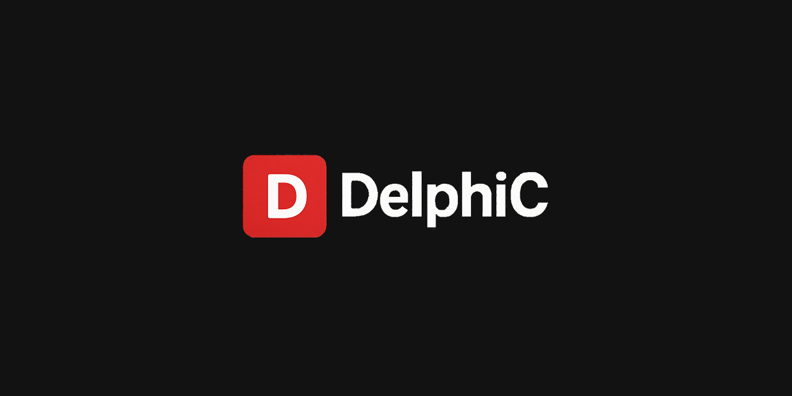

[](https://discord.gg/tinyBigGAMES) [](https://bsky.app/profile/tinybiggames.com)  

## ⚡ Runtime C compilation for Delphi

**DelphiC** is a comprehensive Delphi wrapper for the Tiny C Compiler (TCC), enabling runtime C code compilation, execution, and bidirectional symbol exchange between Delphi and C code. Compile C code to memory, executables, DLLs, or object files directly from your Delphi applications.

[](#)
[](#)
[](#)

## ✨ Features

- 💾 **In-Memory Compilation** - Compile and execute C code at runtime without temporary files
- 📦 **Multiple Output Types** - Generate EXE, DLL, OBJ files, or preprocess-only mode
- 🔄 **Bidirectional Symbols** - Call Delphi functions from C and vice versa
- 🛡️ **Comprehensive Error Handling** - Structured error capture with filename, line numbers, and severity
- 🔐 **Workflow Enforcement** - State management prevents API misuse and crashes
- ⚙️ **Full TCC Options** - Direct access to all TCC compiler flags and settings
- 🔗 **Multi-Unit Support** - Compile and link multiple C source files and object files
- 🎯 **Zero Dependencies** - Self-contained with embedded TCC, no external tools required

## 💡 Use Cases

- 🎮 JIT compilation for scripting engines
- 🔌 Dynamic plugin systems with C-based extensions
- 🏗️ Runtime code generation for DSLs
- 📚 Embedding C libraries without separate compilation
- 🎓 Educational tools demonstrating compilation concepts
- 🔀 Language transpilers targeting C as intermediate representation

## 📋 Requirements

- **OS**: Windows 64-bit
- **Delphi**: Tested on 12.3
- **Target**: x86_64 only

## 📥 Installation

### From Source

1. Clone the repository:
```bash
git clone https://github.com/tinyBigGAMES/DelphiC.git
```

2. Add the `src` folder to your Delphi library path or project search path

3. Add `DelphiC` to your uses clause:
```delphi
uses
  DelphiC;
```

## 🚀 Quick Start

### 👋 Hello World - Memory Execution

```delphi
uses
  DelphiC;  

procedure HelloWorld;
type
  THelloFunc = function(): Integer; cdecl;
var
  LCompiler: TDelphiC;
  LHello: THelloFunc;
begin
  LCompiler := TDelphiC.Create();
  try
    // Configure for in-memory execution
    LCompiler.SetOuput(opMemory);
    
    // Compile C code
    LCompiler.CompileString(
      '#include <stdio.h>' + #10 +
      'int hello() {' + #10 +
      '    printf("Hello from C!\n");' + #10 +
      '    return 42;' + #10 +
      '}'
    );
    
    // Relocate and get function pointer
    if LCompiler.Relocate() then
    begin
      LHello := LCompiler.GetSymbol('hello');
      if Assigned(LHello) then
        WriteLn('Result: ', LHello());
    end;
  finally
    LCompiler.Free();
  end;
end;
```

### 🔄 Calling Delphi from C

```delphi
// Delphi callback function
function DelphiAdd(A, B: Integer): Integer; cdecl;
begin
  Result := A + B;
  WriteLn('Delphi says: ', A, ' + ', B, ' = ', Result);
end;

procedure CallbackExample;
type
  TTestFunc = function(): Integer; cdecl;
const
  CCode = 
    'int delphi_add(int a, int b);' + #10 +
    'int test() {' + #10 +
    '    return delphi_add(10, 20);' + #10 +
    '}';
var
  LCompiler: TDelphiC;
  LTest: TTestFunc;
begin
  LCompiler := TDelphiC.Create();
  try
    LCompiler.SetOuput(opMemory);
    
    // Inject Delphi function into C
    LCompiler.AddSymbol('delphi_add', @DelphiAdd);
    
    LCompiler.CompileString(CCode);
    
    if LCompiler.Relocate() then
    begin
      LTest := LCompiler.GetSymbol('test');
      if Assigned(LTest) then
        WriteLn('C called Delphi, result: ', LTest());
    end;
  finally
    LCompiler.Free();
  end;
end;
```

### 🎯 Generating Executables

```delphi
procedure CreateExecutable;
var
  LCompiler: TDelphiC;
begin
  LCompiler := TDelphiC.Create();
  try
    LCompiler.SetOuput(opEXE);
    LCompiler.SetSubsystem(ssConsole);
    
    LCompiler.CompileString(
      '#include <stdio.h>' + #10 +
      'int main() {' + #10 +
      '    printf("Standalone executable!\n");' + #10 +
      '    return 0;' + #10 +
      '}'
    );
    
    LCompiler.OutputFile('myapp.exe');
    WriteLn('Created myapp.exe');
  finally
    LCompiler.Free();
  end;
end;
```

### 📚 Multi-File Compilation

```delphi
procedure MultiFileProject;
var
  LCompiler: TDelphiC;
begin
  LCompiler := TDelphiC.Create();
  try
    // Compile unit1 to object file
    LCompiler.SetOuput(opOBJ);
    LCompiler.CompileString('int add(int a, int b) { return a + b; }');
    LCompiler.OutputFile('unit1.o');
    
    // Reset and link everything
    LCompiler.Reset();
    LCompiler.SetOuput(opEXE);
    LCompiler.AddFile('unit1.o');  // Link compiled object
    LCompiler.CompileString('int add(int, int); int main() { return add(2, 3); }');
    LCompiler.OutputFile('program.exe');
  finally
    LCompiler.Free();
  end;
end;
```

## 📖 API Overview

### 🔧 Core Methods

| Method | Description |
|--------|-------------|
| `Create()` | Initialize TCC compilation context |
| `Reset()` | Reset compiler for reuse |
| `SetOuput(TDCOutput)` | Set output type (Memory/EXE/DLL/OBJ/Preprocess) |
| `CompileString(code, filename)` | Compile C source from string |
| `AddFile(filename)` | Add C source, object file, or library |
| `Relocate()` | Prepare for in-memory execution |
| `GetSymbol(name)` | Retrieve function/variable pointer |
| `AddSymbol(name, ptr)` | Inject Delphi symbols into C |
| `OutputFile(filename)` | Generate output file |
| `Run(argc, argv)` | Execute compiled program |

### ⚙️ Configuration

| Method | Description |
|--------|-------------|
| `SetOption(option)` | Set any TCC command-line option |
| `SetDebugInfo(enabled)` | Enable debug information (-g) |
| `DisableWarnings()` | Suppress all warnings (-w) |
| `SetWarningsAsErrors()` | Treat warnings as errors (-Werror) |
| `SetSubsystem(TDCSubsystem)` | Set Windows subsystem (Console/GUI) |
| `DefineSymbol(sym, val)` | Define preprocessor symbol |
| `AddIncludePath(path)` | Add include directory |
| `AddLibraryPath(path)` | Add library search path |
| `AddLibrary(name)` | Link against library |

### 🚨 Error Handling

| Method | Description |
|--------|-------------|
| `SetPrintCallback(handler)` | Register error/warning callback |
| `GetErrors()` | Retrieve structured error list |
| `ClearErrors()` | Clear accumulated errors |

## 🛠️ Compiler Options

DelphiC supports all TCC Win64 options via `SetOption()`:

**📝 Preprocessor**: `-I`, `-D`, `-U`, `-E`  
**⚡ Compilation**: `-funsigned-char`, `-fsigned-char`, `-fms-extensions`  
**⚠️ Warnings**: `-w`, `-Wall`, `-Werror`, `-Wimplicit-function-declaration`  
**🔗 Linking**: `-L`, `-l`, `-Wl,-subsystem=`, `-Wl,-stack=`  
**🐛 Debug**: `-g` (bounds checking `-b` not supported on Win64)  
**🎯 Target**: `-mms-bitfields`, `-mno-sse`

See full documentation in source code XML comments.

## 🔄 Workflows

### 💾 Memory Output (for JIT/Scripting)
```
SetOutput(opMemory) → CompileString → [AddSymbol] → Relocate → GetSymbol
```

### 📦 File Output (EXE/DLL/OBJ)
```
SetOutput(opEXE/DLL/OBJ) → CompileString → [AddSymbol] → OutputFile
```

### ▶️ Direct Execution
```
SetOutput(opEXE) → CompileString → Run(argc, argv)
```

## 🚨 Error Handling

```delphi
LCompiler.SetPrintCallback(
  nil,
  procedure(const AError: string; const AUserData: Pointer)
  begin
    WriteLn('[TCC] ', AError);
  end
);

if not LCompiler.CompileString(CCode) then
begin
  var LErrors := LCompiler.GetErrors();
  for var LError in LErrors do
    WriteLn(LError.Filename, ':', LError.Line, ': ', LError.Message);
end;
```

## 📚 Examples

See the `examples/` directory for:
- ✅ Basic compilation and execution
- 🔄 Callback integration
- 📦 Multi-unit projects
- 🚨 Error handling patterns
- 📖 Dynamic library creation

## ⚠️ Limitations

- 🪟 **Win64 only** - No 32-bit or other platform support
- 🚫 **No bounds checking** - The `-b` flag causes crashes on Win64
- 🔧 **No optimization flags** - TCC ignores `-O` options (single-pass compiler)
- 📜 **C99 standard** - Some C11/C23 features may not be supported
- 🚷 **No C++** - Pure C compilation only

## 🏗️ Architecture

DelphiC uses a state machine to enforce correct TCC API usage:

```
🆕 New → ⚙️ Configured → ✅ Compiled → 🚀 Relocated/Finalized
```

Invalid state transitions return `False` and prevent crashes from TCC API misuse.

## 🔨 Building from Source

1. Open `DelphiC - Runtime C compilation for Delphi.groupproj` in `src` folder
2. in `UTestbed.pas`, set `LNum` to test number to run
3. Build an run

No external dependencies required - TCC is embedded as a compiled object.

## 🤝 Contributing

Contributions are welcome! Please:

1. 🍴 Fork the repository
2. 🌿 Create a feature branch
3. 📝 Follow existing code style
4. ✅ Add tests for new features
5. 💾 Commit changes
6. 📤 Push to branch
7. 🔀 Open a Pull Request

## 📄 License

DelphiC is released under the **BSD 3-Clause License**.

Copyright © 2025-present tinyBigGAMES™ LLC. All Rights Reserved.

See [LICENSE](https://github.com/tinyBigGAMES/DelphiC#BSD-3-Clause-1-ov-file) for full license text.

### 📦 Third-Party Components

This library uses:
- **TCC (Tiny C Compiler)** - https://github.com/TinyCC/tinycc

## 💬 Support

- 🐛 **Issues**: [GitHub Issues](https://github.com/tinyBigGAMES/DelphiC/issues)
- 💭 **Discussions**: [GitHub Discussions](https://github.com/tinyBigGAMES/DelphiC/discussions)


## 🙏 Acknowledgments

- **Fabrice Bellard** - Original TCC author
- **TCC Contributors** - Ongoing TCC development
- **Delphi Community** - Testing and feedback

---

<div align="center">

**Made with ❤️ by tinyBigGAMES™**

*"Bridging Delphi and C at runtime"*

</div>